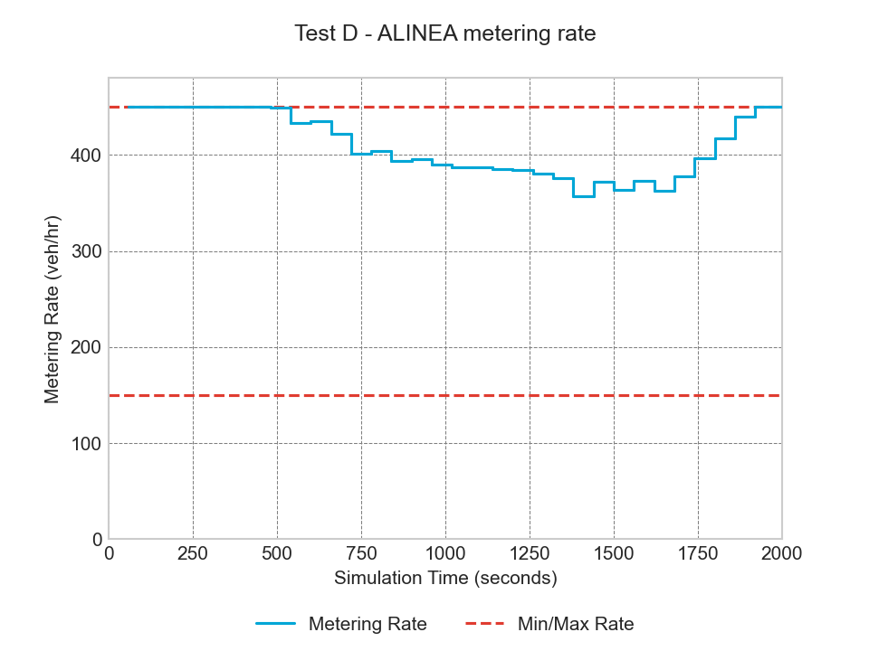
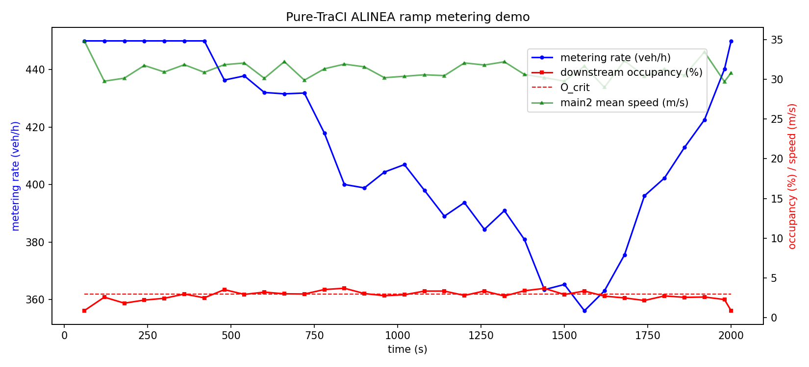
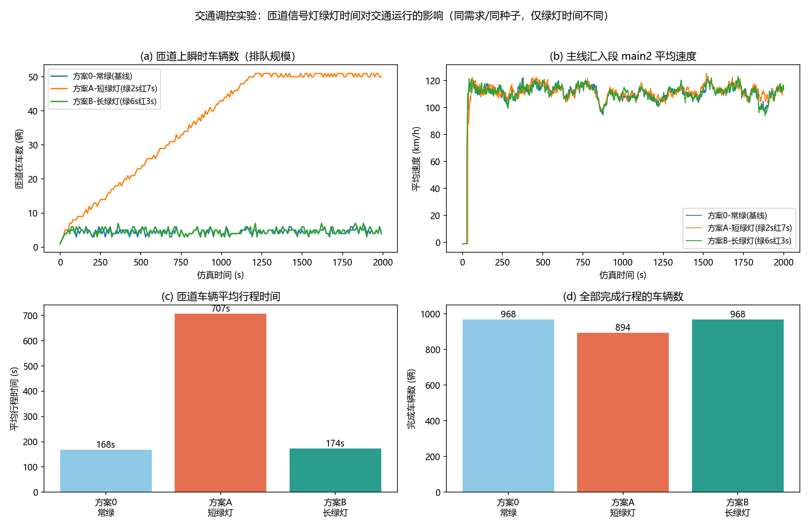

# SUMO / TUD-SUMO 交通仿真学习项目

<p>
  
  
  
</p>

围绕开源微观交通仿真器 **SUMO** 完成的两个课程实验：

1. **实验二（论文复现）**：复现 Evans 等发表于 SoftwareX (2026) 的论文
   *TUD-SUMO: A research-oriented SUMO wrapper for traffic simulation in Python*
   的匝道仿真场景与 Test A–E 五个基准测试，并用**原生 TraCI** 重写了其中的
   ALINEA 匝道控制作为对照；
2. **实验三（交通调控）**：在同一场景上做**匝道信号灯绿灯时间**的单变量对照实验
   （常绿 / 短绿灯 / 长绿灯三种方案），量化绿灯时间对排队、延误的影响。

所有结果均由本仓库中的脚本在本机实际运行生成，固定随机种子后可精确复现。

## 仓库结构

```
.
├── TUD-SUMO复现/            # 实验二：论文复现
│   ├── scenario/                  #   匝道场景（路网/需求/检测器/配置）
│   ├── scripts/                   #   Test A–E 脚本 + 纯 TraCI 演示 + 分析脚本
│   ├── outputs/                   #   运行结果（JSON/CSV/图）
│   ├── screenshots/               #   运行截图（GUI / 命令行 / Python 交互）
│   └── README.md                  #   ★ 详细讲解文档（每个文件是什么、怎么读图、踩坑记录）
├── 交通调控实验/                   # 实验三：绿灯时间调控实验
│   ├── plans/                     #   三种信号方案定义
│   ├── scenario/                  #   复用实验二的路网与需求
│   ├── run_experiment.py          #   三方案自动运行 + 汇总 + 绘图
│   ├── outputs/                   #   对比表 / 对比图 / 各方案原始数据
│   └── README.md                  #   ★ 实验报告（设计、结果表、结论）
```

## 环境要求

| 依赖 | 版本 | 说明 |
|---|---|---|
| [SUMO](https://sumo.dlr.de/) | 1.27.1 | 需要将 `bin` 加入 PATH |
| Python | ≥ 3.10 | TUD-SUMO 的最低要求 |
| TUD-SUMO | 3.3.2 | 论文使用的同一版本 |

```bash
pip install -r requirements.txt
```

网络受限无法使用 pip 时，可运行离线安装脚本（从 PyPI 下载 wheel 解压到本地
`_pylibs` 目录，脚本会自动被 `scripts/common.py` 引用）：

```bash
python TUD-SUMO复现/scripts/setup_deps.py
```

⚠️ **一个真实的坑**：如果 SUMO 安装在含中文的路径下，其 C++ 程序加载 `SUMO_HOME`
指向的 XSD 校验文件会失败，报出没有任何细节的 `Quitting (on unknown error)`。
解决办法是建一个英文路径的目录联接：

```bat
mklink /J C:\sumo_home "你的SUMO安装目录"
set SUMO_HOME=C:\sumo_home
```

## 快速开始

```bash
# 1) 图形界面运行匝道场景（自动开跑，车辆按速度着色）
sumo-gui -c TUD-SUMO复现/scenario/sim.sumocfg --start --delay 25

# 2) 命令行运行并查看全网统计
sumo -c TUD-SUMO复现/scenario/sim.sumocfg

# 3) 复现论文 Test A–E（输出到 TUD-SUMO复现/outputs/）
python TUD-SUMO复现/scripts/test_a_simple_run.py   # 裸跑 + 自动数据收集
python TUD-SUMO复现/scripts/test_b_fcd.py          # 浮动车数据 + 轨迹图
python TUD-SUMO复现/scripts/test_c_space_time.py   # 时空图
python TUD-SUMO复现/scripts/test_d_alinea.py       # ALINEA 匝道控制
python TUD-SUMO复现/scripts/test_e_incident.py     # 动态事故事件

# 4) 纯 TraCI（不依赖 TUD-SUMO）实现同样的 ALINEA 控制，作为对照
python TUD-SUMO复现/scripts/traci_demo.py

# 5) 实验三：绿灯时间三方案对照实验（输出到 交通调控实验/outputs/）
python 交通调控实验/run_experiment.py
```

## 主要结果

### ALINEA 匝道控制（复现论文 Test D）

低需求时放行率保持在 450 veh/h 上限；高峰期下游占有率超过临界值，ALINEA
自动将放行率压至 360–430 veh/h 保护主线；需求回落后放行率回升——
反馈控制的"呼吸"行为清晰可见。

<p align="center">
  
</p>

### 纯 TraCI 对照实现

与 Test D 同参数、同场景，用 SUMO 原生 Python 接口从零实现（逐步读线圈占用率、
自己写相位状态机），用于对照封装与底层的差异：

<p align="center">
  
</p>

### 绿灯时间调控实验（实验三）

同需求、同种子，仅改变匝道信号灯绿灯时间。短绿灯（放行能力 ≈360 veh/h）低于
匝道需求（500 veh/h）时，排队在 2000 s 内累积到 50 辆并回溢阻断入口，全网总延误
恶化约 17 倍；长绿灯（≈900 veh/h）与常绿基线几乎无差别——放行能力必须与需求匹配。

| 指标 | 常绿（基线） | 短绿灯 | 长绿灯 |
|---|---|---|---|
| 完成行程车辆数 | 968 | 894 | 968 |
| 匝道车平均行程时间 (s) | 168.3 | **706.8** | 173.5 |
| 全网总延误 (s) | 3992 | **69570** | 4673 |

<p align="center">
  
</p>

更多结果（时空图、车辆轨迹图、事故事件、检测器时序等）见
[`TUD-SUMO复现/outputs/`](TUD-SUMO复现/outputs/) 与
[`交通调控实验/outputs/`](交通调控实验/outputs/)。

## 复现程度

论文 §3 的五个基准测试全部复现，论文 Table 1 的 13 个接口函数实际用到 9 个：

| 论文内容 | 位置 | 复现情况 |
|---|---|---|
| 匝道场景与需求设定 | §3 / Fig.3 | ✅ 同参数重建 |
| Test A 简单运行 | §3 | ✅ 自动数据收集 |
| Test B 浮动车数据 | §3 | ✅ 23 MB FCD + 轨迹图 |
| Test C 时空图 | §3 | ✅ 仅跟踪 4 条边 |
| Test D ALINEA 匝道控制 | §3 | ✅ 控制日志 + 相位时序/放行率/排队三图 |
| Test E 动态事故 | §3 | ✅ 事件位置与论文一致 |
| 与原生 TraCI 对照 | §4 | ✅ 自写脚本同参数对照 |
| 六项 KPI 性能基准 | §4 | ⚠️ 部分复现（运行时方向一致，圈复杂度等静态指标未测） |

详细的过程、读图方法与踩坑记录见 [`TUD-SUMO复现/README.md`](TUD-SUMO复现/README.md)
与 [`交通调控实验/README.md`](交通调控实验/README.md)。

## 值得记录的几个坑

1. **SUMO_HOME 指向中文路径** → XSD 校验文件加载失败，报无细节的
   `Quitting (on unknown error)`；用 `mklink /J` 建英文路径联接解决；
2. **rou.xml 的 flow 必须按出发时间排序**，乱序的 flow 会被静默忽略，只留一行
   Warning；
3. **匝道建模**：直接汇入 2 车道主线会让匝道在停车线处"找不到空隙"而堵死
   （实测密度 129 veh/km），正确做法是汇入点下游拓为 3 车道、匝道接最外侧
   专用道，让合流由换道模型完成——修复后全网平均延误从 60 s 降到 4 s；
4. **TUD-SUMO 占用率存储口径是 0–1 分数**（源码 `occupancy/100`），与 TraCI
   原生百分数混用会让 ALINEA 反馈量差 100 倍。

## 参考

- C. Evans, M. Rinaldi, H. Taale, S.P. Hoogendoorn.
  *TUD-SUMO: A research-oriented SUMO wrapper for traffic simulation in Python.*
  SoftwareX, 2026, 34: 102745. [DOI](https://doi.org/10.1016/j.softx.2026.102745) ｜
  [TUD-SUMO 官方仓库](https://github.com/DAIMoNDLab/tud-sumo)
- P.A. Lopez, M. Behrisch, L. Bieker-Walz, et al.
  *Microscopic Traffic Simulation using SUMO.* IEEE ITSC 2018.
- M. Papageorgiou, et al. *ALINEA: A local feedback control law for on-ramp metering.*
  Transportation Research Record, 1991.

## 许可

代码仅供学习交流使用。TUD-SUMO 与 SUMO 分别遵循其自身的 Apache-2.0 与
Eclipse Public License 2.0 开源协议。
